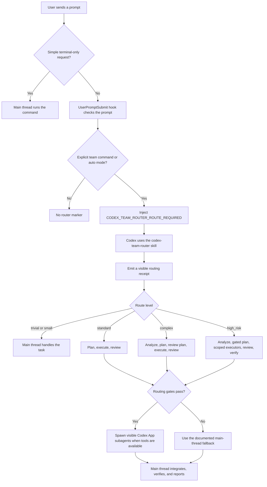

# Codex Team Router

[](https://github.com/inorilzy/codex-team-router/actions/workflows/source-check.yml)

Chinese version: [README.zh-CN.md](README.zh-CN.md).

Release notes: [CHANGELOG.md](CHANGELOG.md).

Codex Team Router is a Codex plugin for explicit team-mode routing before work
starts. By default it activates only when a prompt starts with `team` or
`/team` (Chinese aliases are documented in `README.zh-CN.md`). It helps Codex decide whether a coding request
should stay in the main thread, use a bounded executor, or use visible Codex App
native subagents such as planner, executor, reviewer, explorer, and verifier.

The public plugin id and skill id are both:

```text
codex-team-router
```

This repository is packaged as a Codex marketplace-style repo:

```text
codex-team-router/
  .agents/plugins/marketplace.json
  plugins/codex-team-router/
    .codex-plugin/plugin.json
    hooks/hooks.json
    scripts/
    skills/codex-team-router/
```

## Flow at a glance



## What it does

- Adds a `codex-team-router` skill for coding work: create, modify, fix,
  refactor, review, validate, or build code.
- Emits a visible routing receipt so you can tell whether the router was used:
  `team_route=trivial|small|standard|parallel_read|complex|high_risk`.
- Adds optional plugin hooks for:
  `UserPromptSubmit`, `SessionStart`, `PreToolUse`, `SubagentStart`,
  `SubagentStop`, and `Stop`.
- Defaults to manual team mode. Use `team <task>` or `/team <task>` to enter
  the router. Set
  `CODEX_TEAM_ROUTER_MODE=auto` to restore automatic engineering-prompt
  detection.
- Bundles custom-agent templates for:
  `analyst`, `planner`, `plan-reviewer`, `executor`, `reviewer`, `explorer`,
  and `verifier`.
- Uses role model profiles:
  `gpt-5.5`, `gpt-5.4`, and `gpt-5.4-mini`, with reasoning effort mapped per
  role.
- Includes a model catalog fallback checker. It reads
  `~/.codex/cc-switch-model-catalog.json` first, then falls back to
  `~/.codex/models_cache.json`.
- Includes `scripts/doctor.mjs` for install, hook, model, and template health
  checks.

## What it does not do

- It does not bypass opt-out, high-risk confirmation, or tool-availability
  gates. The hook marker `CODEX_TEAM_ROUTER_ROUTE_REQUIRED` is team/auto routing
  authorization for this plugin, but spawning still falls back to the main
  thread when a gate blocks it.
- It is not a full oh-my-codex, OMO, or external multi-agent runtime. There is
  no mailbox system, detached worktree pool, or external task runner.
- It does not force every request into subagents. Simple terminal-only requests
  should stay in the main thread.

Official references:

- [Codex subagents](https://developers.openai.com/codex/subagents)
- [Codex hooks](https://developers.openai.com/codex/hooks)
- [Build Codex plugins](https://developers.openai.com/codex/plugins/build)

Related project notes and adopted ideas are tracked in
[docs/research-notes.md](docs/research-notes.md).

## Install from GitHub

Add this repo as a marketplace source. Sparse checkout is recommended so Codex
fetches only the marketplace file and this plugin:

```powershell
codex plugin marketplace add inorilzy/codex-team-router --sparse .agents/plugins --sparse plugins/codex-team-router
codex plugin marketplace upgrade
codex plugin add codex-team-router@codex-team-router
```

Then restart Codex App or open a new thread. Review and trust the hooks in the
Codex App Hooks UI, or when Codex prompts you through `/hooks`.

Check the install:

```powershell
codex plugin list
node plugins/codex-team-router/scripts/doctor.mjs
```

If you are running the doctor from the installed plugin cache instead of a clone,
run it from that cached plugin root:

```powershell
node scripts/doctor.mjs
```

## Local development install

Clone the repo, then add the local repo root as a marketplace:

```powershell
git clone https://github.com/inorilzy/codex-team-router.git
cd codex-team-router
codex plugin marketplace add .
codex plugin add codex-team-router@codex-team-router
```

After editing plugin code, run the validators:

```powershell
python $env:USERPROFILE\.codex\skills\.system\skill-creator\scripts\quick_validate.py plugins\codex-team-router\skills\codex-team-router
python $env:USERPROFILE\.codex\skills\.system\plugin-creator\scripts\validate_plugin.py plugins\codex-team-router
node plugins\codex-team-router\scripts\check-source.mjs
node plugins\codex-team-router\scripts\doctor.mjs
```

Before publishing plugin changes, run a local marketplace install smoke test in
a temporary `CODEX_HOME`:

```powershell
node plugins\codex-team-router\scripts\smoke-install.mjs
```

## Expected routing behavior

In default manual mode, start a prompt with `team` or `/team` to enter the
router. Plain engineering prompts do not inject the route marker unless
`CODEX_TEAM_ROUTER_MODE=auto` is set.

The router classifies the routed task by intent, domain, and complexity:

```text
intent: implement; domain: visual; authorization: explicit
prompt_complexity: medium; signals: frontend/ui, complete artifact
team_route: standard; execution: subagents; reason: team routing gates passed
```

Typical routes:

- `trivial`: simple questions and simple terminal commands.
- `small`: tiny local edits where the main thread is enough.
- `standard`: bounded features, straightforward UI, simple apps.
- `parallel_read`: read-heavy scans or independent exploration.
- `complex`: complete user-facing apps, games, multi-step changes, or review
  work with meaningful risk.
- `high_risk`: security-sensitive, destructive, migration, architecture, or
  high-blast-radius work.

For `standard`, `complex`, `parallel_read`, or `high_risk` routes, Codex should
decompose the task before implementation. The router marker authorizes the
skill to choose visible native subagents when the opt-out, high-risk
confirmation, and native-tool availability gates allow it.

## Test prompts

These prompts are useful after install and hook trust:

```text
Run git status --short and then stop.
```

Expected: no route-required marker. This is a simple terminal-only request.

```text
Review this plugin and find improvements.
```

Expected: no route-required marker in default manual mode.

```text
team Review this plugin and find improvements.
```

Expected: marker is injected, intent is `review`, domain is `infra`,
`authorization=explicit`, and `team_route=complex`.

```text
Create a simple HTML counter page.
```

Expected: no route-required marker in default manual mode.

```text
/team Create a simple HTML counter page.
```

Expected: marker is injected, `authorization=explicit`, and
`team_route=standard`.

```text
Create an Angry Birds-style mini game in a single HTML file.
```

Expected: no route-required marker in default manual mode.

```text
team Create an Angry Birds-style mini game in a single HTML file.
```

Expected: marker is injected and `team_route=complex`, because the prompt
implies projectile motion, collision, scoring, and game state.

```text
Scan this repository for hook and doctor issues without changing files.
```

Expected: no route-required marker in default manual mode.

```text
team Scan this repository for hook and doctor issues without changing files.
```

Expected: marker is injected, intent is `investigate`, and
`team_route=parallel_read`.

```text
Plan a database permission migration with security, rollback, and release validation.
```

Expected: no route-required marker in default manual mode.

```text
team Plan a database permission migration with security, rollback, and release validation.
```

Expected: marker is injected and `team_route=high_risk`.

```text
Review this repository for hook and doctor issues.
```

Expected: no route-required marker in default manual mode. With
`CODEX_TEAM_ROUTER_MODE=auto`, marker is injected and `authorization=auto`.

```text
Use planner/executor/reviewer subagents to create a small HTML app.
```

Expected: no route-required marker in default manual mode unless prefixed with
`team`. With `CODEX_TEAM_ROUTER_MODE=auto`, marker is injected and
`authorization=explicit`.

## Hooks and environment variables

The bundled plugin hooks are intentionally minimal:

- `UserPromptSubmit`: detects explicit team commands and injects routing
  context. With `CODEX_TEAM_ROUTER_MODE=auto`, it also detects likely
  engineering prompts.
- `SessionStart`: writes team-router health state.
- `PreToolUse`: warns before implementation-like tools when a routed prompt has
  not produced a visible routing decision yet.
- `SubagentStart` and `SubagentStop`: record child-agent lifecycle evidence.
- `Stop`: records completion gate state and warns about missing validation
  evidence.

The hook state is written under `.codex/team-router/`. The compact
`status.json` file is the quickest way to inspect the current route, agent
counts, validation evidence count, warnings, and the next suggested action.

Default mode is warn-only. Optional environment variables:

```text
CODEX_TEAM_ROUTER_SUBAGENT_GATE=warn|enforce|off
CODEX_TEAM_ROUTER_HOOK_MODE=warn|enforce
CODEX_TEAM_ROUTER_MODE=manual|auto
```

Legacy aliases are also accepted:

```text
SQUAD_SUBAGENT_GATE
SQUAD_HOOK_MODE
```

## Model profiles

The bundled defaults are:

```text
smartest_deep   gpt-5.5       xhigh
smartest_review gpt-5.5       high
smart_code      gpt-5.4       high
smart_verify    gpt-5.4       medium
fast_scan       gpt-5.4-mini  low
```

Refresh the local model visibility report:

```powershell
node plugins\codex-team-router\scripts\refresh-model-profiles.mjs plugins\codex-team-router\skills\codex-team-router\references\model-profiles.generated.json
```

The generated file records `catalog_path`, `catalog_paths_checked`, per-profile
`source`, and warnings when local catalogs do not expose a documented default.

## Maintenance scripts

- `scripts/check-source.mjs`: runs the source-tree checks used by GitHub
  Actions. It currently runs route fixtures, repo hygiene, source-only doctor,
  machine-readable JSON report checks, and a temporary agent-template write
  smoke test.
- `scripts/check-source.mjs --json`: emits the aggregate machine-readable
  source-check report, including text-mode and JSON-mode child checks.
- `scripts/repo-hygiene.mjs`: checks README language split, marketplace and
  plugin identity, skill identity, and absence of generated runtime state.
- `scripts/route-fixtures.mjs`: runs hook classification fixtures in temporary
  workspaces and verifies marker injection, route classification, `status.json`,
  `task_board`, and `next_action`.
- `scripts/smoke-install.mjs`: creates a temporary `CODEX_HOME`, adds the local
  repo marketplace, installs `codex-team-router@codex-team-router`, and checks
  that Codex reports it as installed and enabled.
- `scripts/sync-agents.mjs`: dry-runs or installs bundled custom-agent
  templates into project-local `.codex/agents`, global `~/.codex/agents`, or a
  custom target directory. It copies missing files by default and overwrites
  only with `--force --write`.
- `scripts/sync-agents.mjs --json`: emits a machine-readable dry-run or write
  report for agent template sync plans.
- `scripts/doctor.mjs --source-only`: checks source-tree structure, hook
  simulation, runtime status summary, and bundled custom-agent templates without
  requiring a local Codex install.
- `scripts/doctor.mjs`: checks plugin structure, hook simulation, model catalog
  fallback, runtime status summary, install state, hook trust, and
  bundled/global custom-agent drift.
- `scripts/repo-hygiene.mjs --json` and `scripts/doctor.mjs --json`: emit
  machine-readable health reports for CI, external orchestrators, or local
  dashboards.
- `scripts/route-fixtures.mjs --json`: emits a machine-readable route
  regression report for dashboards or CI adapters.

All machine-readable reports include `schema_version: 1` at the top level. See
[docs/json-reports.md](docs/json-reports.md) for the report contract.

The GitHub Actions workflow runs both `check-source.mjs` and
`check-source.mjs --json` on Ubuntu and Windows, so pull requests can validate
the source tree without needing a Codex App profile or local model catalog.

See [docs/release-checklist.md](docs/release-checklist.md) for the full
pre-publish checklist.

Install bundled agent templates into the current project:

```powershell
node plugins\codex-team-router\scripts\sync-agents.mjs
node plugins\codex-team-router\scripts\sync-agents.mjs --write
```

Install them globally:

```powershell
node plugins\codex-team-router\scripts\sync-agents.mjs --global --write
```

## Troubleshooting

Check whether Codex sees the marketplace and plugin:

```powershell
codex plugin marketplace list
codex plugin list
```

If the plugin is installed but hooks do not run, restart Codex App or open a
new thread, then trust the changed hooks in the Hooks UI or through `/hooks`.

If `doctor.mjs` says the plugin is not installed, it is safe for a source clone
before installation. After installation it should show the plugin as installed
and enabled.

If model detection only sees cc-switch proxy models, make sure
`~/.codex/models_cache.json` exists. The refresh script falls back to that file
when `~/.codex/cc-switch-model-catalog.json` does not contain the GPT defaults.

## License

MIT
