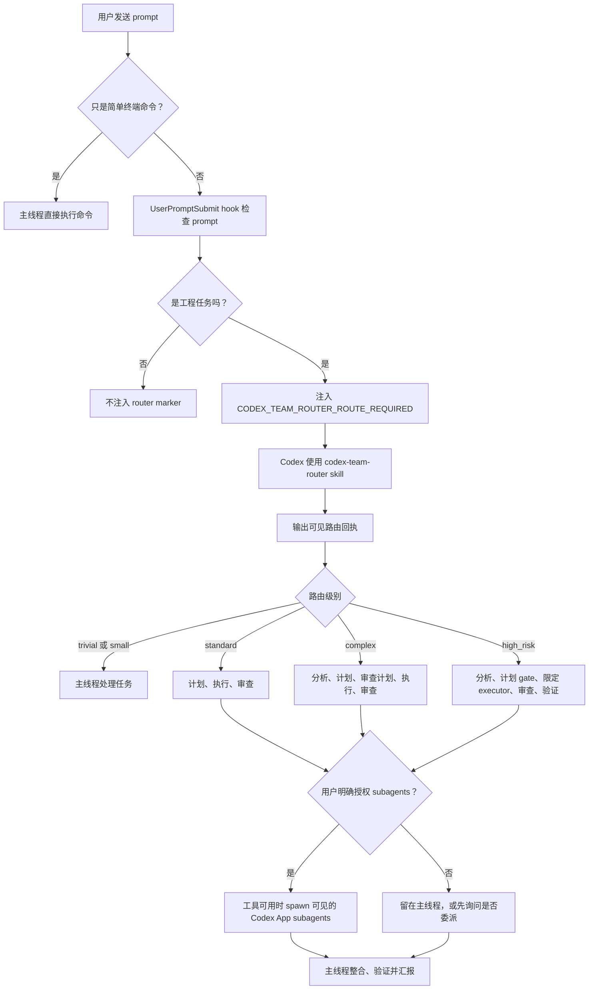

# Codex Team Router

[](https://github.com/inorilzy/codex-team-router/actions/workflows/source-check.yml)

英文版：[README.md](README.md)。

Codex Team Router 是一个 Codex 插件，用来在工程任务开始前先做路由判断。它会帮助 Codex 判断当前请求应该留在主线程完成，还是应该使用有边界的 executor，或者使用 Codex App 里可见的原生 subagent，例如 planner、executor、reviewer、explorer 和 verifier。

公开插件 id 和 skill id 都是：

```text
codex-team-router
```

这个仓库按 Codex marketplace 风格打包：

```text
codex-team-router/
  .agents/plugins/marketplace.json
  plugins/codex-team-router/
    .codex-plugin/plugin.json
    hooks/hooks.json
    scripts/
    skills/codex-team-router/
```

## 一图看懂



## 它能做什么

- 增加 `codex-team-router` skill，用于创建、修改、修复、重构、审查、验证或构建代码。
- 输出可见的路由回执，让你能分辨 router 是否被使用：
  `team_route=trivial|small|standard|parallel_read|complex|high_risk`。
- 提供可选插件 hooks：
  `UserPromptSubmit`、`SessionStart`、`PreToolUse`、`SubagentStart`、`SubagentStop` 和 `Stop`。
- 打包 7 个 custom-agent 模板：
  `analyst`、`planner`、`plan-reviewer`、`executor`、`reviewer`、`explorer` 和 `verifier`。
- 使用角色模型 profile：
  `gpt-5.5`、`gpt-5.4` 和 `gpt-5.4-mini`，并按角色映射 reasoning effort。
- 提供模型 catalog fallback 检查。它会先读 `~/.codex/cc-switch-model-catalog.json`，再 fallback 到 `~/.codex/models_cache.json`。
- 提供 `scripts/doctor.mjs`，用于检查安装状态、hook、模型和 agent 模板健康度。

## 它不会做什么

- 它不会绕过 Codex 的 subagent 授权边界。hook marker `CODEX_TEAM_ROUTER_ROUTE_REQUIRED` 只表示“这个请求需要路由并输出回执”，并不等于自动授权 spawn subagents。
- 它不是完整的 oh-my-codex、OMO 或外部 multi-agent runtime。它没有 mailbox 系统、独立 worktree 池，也没有外部任务运行器。
- 它不会强迫所有请求都走 subagents。简单的 terminal-only 请求应该留在主线程直接完成。

官方参考：

- [Codex subagents](https://developers.openai.com/codex/subagents)
- [Codex hooks](https://developers.openai.com/codex/hooks)
- [Build Codex plugins](https://developers.openai.com/codex/plugins/build)

相关项目调研和已采纳思路记录在 [docs/research-notes.md](docs/research-notes.md)。

## 从 GitHub 安装

把这个仓库添加为 marketplace source。建议使用 sparse checkout，这样 Codex 只会拉取 marketplace 文件和这个插件：

```powershell
codex plugin marketplace add inorilzy/codex-team-router --sparse .agents/plugins --sparse plugins/codex-team-router
codex plugin marketplace upgrade
codex plugin add codex-team-router@codex-team-router
```

然后重启 Codex App，或者打开一个新线程。在 Codex App 的 Hooks UI 中检查并信任 hooks，或者在 Codex 通过 `/hooks` 提示时信任它们。

检查安装状态：

```powershell
codex plugin list
node plugins/codex-team-router/scripts/doctor.mjs
```

如果你是在已安装插件的 cache 目录运行 doctor，而不是在源码 clone 中运行，请在缓存插件根目录执行：

```powershell
node scripts/doctor.mjs
```

## 本地开发安装

clone 仓库，然后把本地仓库根目录添加为 marketplace：

```powershell
git clone https://github.com/inorilzy/codex-team-router.git
cd codex-team-router
codex plugin marketplace add .
codex plugin add codex-team-router@codex-team-router
```

修改插件代码后，运行校验：

```powershell
python $env:USERPROFILE\.codex\skills\.system\skill-creator\scripts\quick_validate.py plugins\codex-team-router\skills\codex-team-router
python $env:USERPROFILE\.codex\skills\.system\plugin-creator\scripts\validate_plugin.py plugins\codex-team-router
node plugins\codex-team-router\scripts\check-source.mjs
node plugins\codex-team-router\scripts\doctor.mjs
```

发布插件变更前，建议用临时 `CODEX_HOME` 跑本地 marketplace 安装冒烟测试：

```powershell
node plugins\codex-team-router\scripts\smoke-install.mjs
```

## 预期路由行为

router 会按 intent、domain 和 complexity 分类当前 prompt：

```text
intent: implement; domain: visual; authorization: implicit
prompt_complexity: medium; signals: frontend/ui, complete artifact
team_route: standard; execution: main; reason: no explicit subagent authorization
```

常见路由：

- `trivial`：简单问题和简单终端命令。
- `small`：主线程足够处理的微小本地修改。
- `standard`：有边界的功能、直接的 UI、小型 app。
- `parallel_read`：读多写少的扫描或独立探索。
- `complex`：完整用户界面 app、游戏、多步骤修改，或有实质风险的 review 工作。
- `high_risk`：安全敏感、破坏性、迁移、架构调整，或影响面很大的任务。

对于 `standard`、`complex` 或 `high_risk` 路由，Codex 应该在实现前先拆解任务。只有当用户明确要求 subagents、delegation、parallel work，或者 planner/executor/reviewer 工作流时，Codex 才应该 spawn 可见的原生 subagents；或者用户选择的插件 prompt 本身明确要求使用 subagents。

## 测试 prompt

安装并信任 hooks 后，可以用这些 prompt 测试：

```text
运行 git status --short，然后结束
```

预期：不注入 route-required marker。这是简单 terminal-only 请求。

```text
检查一下这个插件的各个方面，看看还有没有改进和优化的空间。
```

预期：注入 marker，intent 是 `review`，domain 是 `infra`，并且 `team_route=complex`。

```text
创建一个简单的 HTML 计数器页面。
```

预期：注入 marker，并且 `team_route=standard`。

```text
创建一个愤怒的小鸟小游戏，单 HTML 文件。
```

预期：注入 marker，并且 `team_route=complex`，因为这个 prompt 隐含抛物线、碰撞、计分和游戏状态。

```text
查找这个仓库里 hooks 和 doctor 的实现，梳理潜在问题，不要修改文件。
```

预期：注入 marker，intent 是 `investigate`，并且 `team_route=parallel_read`。

```text
规划一次数据库权限迁移，涉及安全、回滚和发布验证。
```

预期：注入 marker，并且 `team_route=high_risk`。

```text
Use planner/executor/reviewer subagents to create a small HTML app.
```

预期：注入 marker，并且 `authorization=explicit`。如果工具可用，Codex 可以使用可见的原生 subagents。

## Hooks 和环境变量

打包的插件 hooks 是刻意保持轻量的：

- `UserPromptSubmit`：检测可能的工程 prompt，并注入路由上下文。
- `SessionStart`：写入 team-router 健康状态。
- `PreToolUse`：当已路由的 prompt 还没有输出可见路由决策时，在实现类工具调用前提醒。
- `SubagentStart` 和 `SubagentStop`：记录 child-agent 生命周期证据。
- `Stop`：记录 completion gate 状态，并在缺少验证证据时提醒。

hook 状态会写入 `.codex/team-router/`。其中 `status.json` 是最快的检查入口，里面会显示当前 route、agent 计数、验证证据数量、warning 数量和下一步建议。

默认模式是 warn-only。可选环境变量：

```text
CODEX_TEAM_ROUTER_SUBAGENT_GATE=warn|enforce|off
CODEX_TEAM_ROUTER_HOOK_MODE=warn|enforce
```

兼容旧别名：

```text
SQUAD_SUBAGENT_GATE
SQUAD_HOOK_MODE
```

## 模型 profiles

内置默认值：

```text
smartest_deep   gpt-5.5       xhigh
smartest_review gpt-5.5       high
smart_code      gpt-5.4       high
smart_verify    gpt-5.4       medium
fast_scan       gpt-5.4-mini  low
```

刷新本地模型可见性报告：

```powershell
node plugins\codex-team-router\scripts\refresh-model-profiles.mjs plugins\codex-team-router\skills\codex-team-router\references\model-profiles.generated.json
```

生成的文件会记录 `catalog_path`、`catalog_paths_checked`、每个 profile 的 `source`，以及当本地 catalog 没暴露默认模型时的 warning。

## 维护脚本

- `scripts/check-source.mjs`：运行 GitHub Actions 使用的源码树检查。目前会运行 route fixtures、repo hygiene、source-only doctor，以及机器可读 JSON report 检查。
- `scripts/repo-hygiene.mjs`：检查 README 中英文拆分、marketplace 和插件身份、skill 身份，以及是否没有生成的运行时状态。
- `scripts/route-fixtures.mjs`：在临时 workspace 中运行 hook 分类 fixtures，检查 marker 注入、route 分类、`status.json`、`task_board` 和 `next_action`。
- `scripts/smoke-install.mjs`：创建临时 `CODEX_HOME`，添加本地 repo marketplace，安装 `codex-team-router@codex-team-router`，并检查 Codex 是否显示 installed 和 enabled。
- `scripts/sync-agents.mjs`：预览或安装 bundled custom-agent 模板到项目 `.codex/agents`、全局 `~/.codex/agents` 或自定义目录。默认只复制缺失文件；只有显式使用 `--force --write` 才覆盖不同文件。
- `scripts/doctor.mjs --source-only`：只检查源码树结构、hook 模拟、runtime status summary 和 bundled custom-agent 模板，不需要本地 Codex 安装。
- `scripts/doctor.mjs`：检查插件结构、hook 模拟、模型 catalog fallback、runtime status summary、安装状态、hook trust，以及 bundled/global custom-agent 是否漂移。
- `scripts/repo-hygiene.mjs --json` 和 `scripts/doctor.mjs --json`：输出机器可读健康报告，可供 CI、外部 orchestrator 或本地 dashboard 解析。
- `scripts/route-fixtures.mjs --json`：输出机器可读路由回归报告，可供 dashboard 或 CI adapter 解析。

GitHub Actions workflow 会在 Ubuntu 和 Windows 上通过 `check-source.mjs` 运行 `route-fixtures.mjs`、`repo-hygiene.mjs`、`doctor.mjs --source-only`，并验证这三类检查的 JSON report 模式，所以 pull request 可以在没有 Codex App profile 或本地模型 catalog 的环境里验证源码树。

完整发布前检查见 [docs/release-checklist.md](docs/release-checklist.md)。

安装 bundled agent templates 到当前项目：

```powershell
node plugins\codex-team-router\scripts\sync-agents.mjs
node plugins\codex-team-router\scripts\sync-agents.mjs --write
```

安装到全局：

```powershell
node plugins\codex-team-router\scripts\sync-agents.mjs --global --write
```

## 故障排查

检查 Codex 是否能看到 marketplace 和插件：

```powershell
codex plugin marketplace list
codex plugin list
```

如果插件已经安装但 hooks 没运行，重启 Codex App 或打开新线程，然后在 Hooks UI 或 `/hooks` 中信任变更后的 hooks。

如果 `doctor.mjs` 提示插件未安装，而你是在源码 clone 中运行，这是正常的。安装后它应该显示插件处于 installed 和 enabled 状态。

如果模型检测只看到 cc-switch 代理模型，请确认 `~/.codex/models_cache.json` 存在。当 `~/.codex/cc-switch-model-catalog.json` 不包含 GPT 默认模型时，refresh 脚本会 fallback 到这个文件。

## License

MIT
